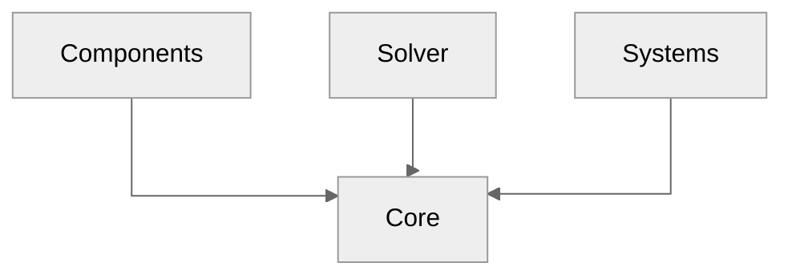

# PBD2D

Unity Position Based Dynamics in two dimensions

## Table od Contents

- [PBD2D](#pbd2d)
  - [Table od Contents](#table-od-contents)
  - [Getting started](#getting-started)
  - [Introduction](#introduction)
  - [Systems](#systems)
    - [Constraints](#constraints)
      - [Position Based Dynamics](#position-based-dynamics)
      - [Edge Length Constraint System](#edge-length-constraint-system)
      - [Triangle Area Constraint System](#triangle-area-constraint-system)
      - [Shape Matching Constraint System](#shape-matching-constraint-system)
    - [Collisions](#collisions)
      - [Point Line Collision System](#point-line-collision-system)
    - [Debug](#debug)
      - [Mouse Interaction System](#mouse-interaction-system)
    - [Graphics](#graphics)
  - [Components](#components)
    - [TriMesh](#trimesh)
    - [Ground](#ground)
  - [Architecture](#architecture)
  - [Roadmap](#roadmap)
    - [v0.1.0](#v010)
    - [v1.0.0](#v100)
    - [v2.0.0](#v200)
  - [Dependencies](#dependencies)
  - [Contributors](#contributors)
  - [Bibliography](#bibliography)

## Getting started

TODO: Add note about packages/and possible upm registry

## Introduction

Position based dynamics is a great method for interactive physics simulation.
For the newcomers the [paper][muller.2007][^1] is highly recommended.

... or [survey][bender.2017][^3]

TODO: Add note about triangulation.

## Systems

### Constraints

#### Position Based Dynamics

#### Edge Length Constraint System

System responsible for resolving edge length constraint, the most common constraint in PBD simulation.
Constraint is defined in the following way

$$ C(p_1, p_2) = \| \vec p_1 - \vec p_2 \| - \ell $$

where $\ell$ is rest length of the edge $(p_1, p_2)$.

#### Triangle Area Constraint System

System responsible for resolving triangle area (signed) constraint.
Constraint enforces that triangle area is conserved during the simulation.
The constraint function is defined in the following way

$$ C(p_1, p_2, p_3) = \vec p_{12} \times \vec p_{13} - A$$

where $p_{ij} = p_j - p_i$ and $A$ is 2 times rest area of the triangle $(p_1, p_2, p_3)$.

#### Shape Matching Constraint System

The system is responsible for resolving the shape matching constraint.
Shape matching formulation can be found in the
[paper][muller.2005][^2].
The method has many advantages:

- can be easly embeded withing PBD framework,
- can be used for simulation _meshless_ objects,
- it is computationally cheap,
- can be used for simulation (quasi) rigid bodies.

Shape matching problem can be formulated using the following function

$$ f(\vec p, \vec q) = \sum_i w_i (R\vec q_i - \vec p_i)^2$$

where weight $w_i$ corresponds to inverse mass,
$q_i$ to the initial relative position with respect to the initial center of mass $t_0$,
and $p_i$ to the current relative position with respect to the current center of mass $t$.

The goal is to find rotation $R$, and translation $t$ that minimizes the function $f(\vec p, \vec q)$.
It can be shown analytically that such rotation $R$ can be found as a rotational part of the given matrix

$$A_{pq} = \sum_i m_i \vec p_i \vec q_i^{\mathsf T}$$

System supports the linear deformation model (see [^2] for more details).

**TODO:...**

### Collisions

#### Point Line Collision System

System responsible for detecting and resolving collisions between bodies which provide point and line (infinite).
It works on components which implement the `IPointLineCollisionTuple`.
For example system is responsible for resolving [TriMesh](#trimesh)-[Ground](#ground) collisions.

### Debug

#### Mouse Interaction System

System used for interacting mouse pointer with the simulated object, rather for debug purposes.
It works on components which implement the `IMouseInteractionComponent`.

### Graphics

## Components

### TriMesh

The simplest two-dimensional structure made of triangles.
One can convert sprites to simulated objects using built-in triangulator and scriptable objects.
**TODO**: tutorial how to.

Supported constraints:

- Edge length constraint (see [system](#edge-length-constraint-system)),
- Triangle area constraint (see [system](#triangle-area-constraint-system)),
- Shape matching constraint (see [system](#shape-matching-constraint-system))

### Ground

As the name suggests, the component represent the plane surface.
**TODO:**...

Implemented collisions:

- with [TriMesh](#trimesh).

## Architecture

The project architecture is based on the custom [ECS](https://en.wikipedia.org/wiki/Entity_component_system) pattern.
The package is divided into three separate assemblies and the _Core_ one, which defines relations between them:

- `andywiecko.PBD2D.Core` contains all contracts, common structs, and all required abstractions.
- `andywiecko.PBD2D.Components` which consists of components contracts implementations.
- `andywiecko.PBD2D.Systems` contains all available systems for components, i.e. all logic can be found here.
- `andywiecko.PBD2D.Solver` where one can find logic for system scheduling and execution order.

Below one can find a dependency graph for the main project assemblies.
Click on the selected graph element to see the details.

## Roadmap

### v0.1.0

- [X] ~~Reimport and refactor tri mesh structure.~~
- [X] ~~Introduce list of constraints.~~
- [X] ~~Unify Bvt Systems.~~
- [X] ~~Remove static from `ComponentsSystemsRegistry`, by introducing the `World` class.~~
- [ ] [!] **Restitution**
- [X] ~~Support for rotation at transform~~
- [ ] Add friction and restitution for trifield-trifield collisions
- [ ] Cleanup steps and substep: replace with names: steps, iterations, introduce dt and h = dt / N, where N is number of steps.
- [ ] Add cheap collisions edge-edge
- [ ] Refactor tuples constructor.
- [ ] Move external edges to trimesh
- [ ] Refactor TriMesh gizmos
- [ ] Test for most of the systems.
- [ ] Investigate performance with combined dependencies.
- [ ] Sample scenes + build online.
  - [ ] Washing machine scene (collisions)
  - [ ] Constraint scene
  - [ ] Friction scene
  - [ ] Restitution scene 
- [ ] Move math/collection related parts into custom packages.
- [ ] Docs.
- [ ] CI/CD, git dependencies for unity-test-runner?
- [ ] refactor triangulator editor, add support for raw data
- [ ] Add preview gifs for fluids and rods.
- [ ] Shuffle constraint on creation (more randomized behavior)
- [ ] Refactor shape matching constraint

### v1.0.0

- [ ] Static box?
- [ ] Static circle, static capsule?
- [ ] TriMesh self collisions (external points/bvt/collisions).
- [ ] Reimport and refactor rod structure.
- [ ] Refactor system class to not be derived from `MonoBehaviour`. 
- [ ] Reimport and refactor position based fluid.
- [ ] Fluid "fancy" shader.
- [ ] Use **dynamic** bounding volume tree for scheduling the collision pairs. 
- [ ] Destructible bodies.
- [ ] Extended PBD?

### v2.0.0

- [ ] Position based rigid bodies
- [ ] Continous collisions.
- [ ] GPU fluids.
- [ ] Sign distance field collisions.
- [ ] Position based "smoke".

## Dependencies

- [`Unity.Burst`](https://docs.unity3d.com/Packages/com.unity.burst@1.6/manual/index.html)
- [`Unity.Mathematics`](https://docs.unity3d.com/Packages/com.unity.mathematics@1.2/manual/index.html)
- [`Unity.Collections`](https://docs.unity3d.com/Packages/com.unity.collections@1.0/manual/index.html)
- [`Unity.Jobs`](https://docs.unity3d.com/Manual/JobSystem.html)
- [`andywiecko.BurstTriangulator`](https://github.com/andywiecko/BurstTriangulator)
- [`andywiecko.BurstCollections`](https://github.com/andywiecko/BurstCollections)
- [`andywiecko.BurstMathUtils`](https://github.com/andywiecko/BurstMathUtils)

## Contributors

- [Andrzej Więckowski, Ph.D](https://andywiecko.github.io/).

## Bibliography

[muller.2007]:https://doi.org/10.1016/j.jvcir.2007.01.005
[^1]:M.Müller, B.Heidelberger, M.Hennix, and J.Ratcliff, "Position based dynamics," [J. Vis. Commun. Image Represent., **18**, 2 (2007)][muller.2007].

[muller.2005]:https://doi.org/10.1145/1073204.1073216
[^2]:M.Müller, B.Heidelberger, M.Teschner, and M.Gros, "Meshless deformations based on shape matching," [ACM Trans. Graph. **24**, 3 (2005)][muller.2005].

[bender.2017]:https://doi.org/10.2312/egt.20171034
[^3]:J.Bender, M.Müller, and M.Macklin, "A Survey on Position Based Dynamics," [EG '17: Proceedings of the European Association for Computer Graphics: Tutorials (2017)][bender.2017].
