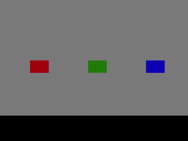
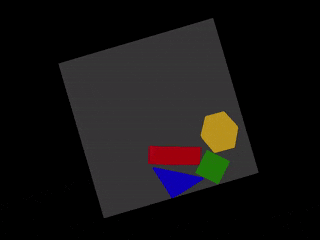
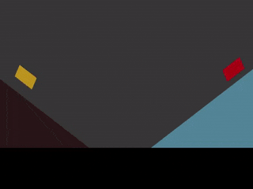
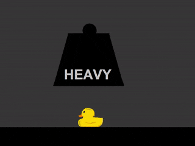
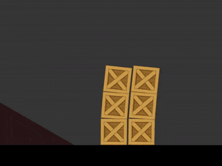
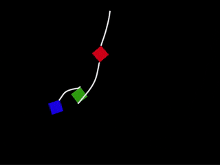
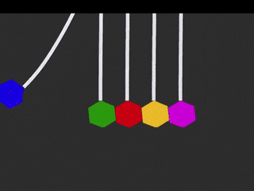
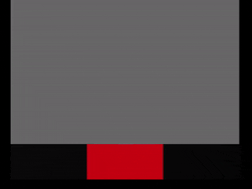
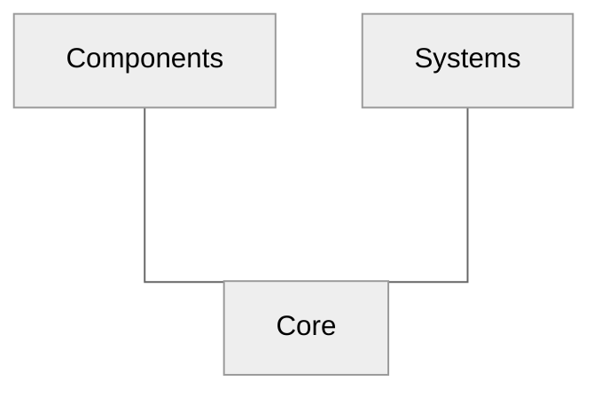

# PBD2D

Unity package for Position Based Dynamics in two dimensions.

> **Warning**
>
> The package is in a preview state.
> The API may change without advance notice.
> Production usage is not recommended.

  

The package provides an implementation of _position based dynamics_ (PBD) [^1]
[^3] [^5] using HPC# (via Burst compiler) 
including extended position based dynamics (xPBD) [^4],
shape-matching [^2], and
various collision algorithms with a basic friction model [^6].
There are also upcoming features regarding one-dimensional structures (rods) [^7] [^8]
and fluids [^9] with soft bodies coupling.

Check out Matthias Müller's YouTube channel [**10 Minute Physics**](https://www.youtube.com/channel/UCTG_vrRdKYfrpqCv_WV4eyA) for the great tutorial about PBD-related topics!

**Package summary:**

- (Extended) position based dynamics, including:
  - edge length constraint
  - triangle area constraint
  - shape matching constraint
  - stencil bending constraint
- Collision systems:
  - point-line
  - capsule-capsule
  - point-trifield
- Generating simulation bodies using sprites.
- Mouse interaction (translation, rotation)
- Entities:
  - edgemesh
  - trimesh (triangle mesh)
  - ground
  - points locker
  - point point connector

## Gallery

One can play the presented demos [**here**](https://andywiecko.github.io/PBD2D-examples).
See [`PDB2D-examples`](https://github.com/andywiecko/PBD2D-examples) github repo for source codes and scenes.

> **Warning**
>
> Currently, `Burst` compiler is not supported with `WebGL`.
> Demo scenes are for preview only.
> Performance may be limited in web builds.

## Table od Contents

- [PBD2D](#pbd2d)
  - [Gallery](#gallery)
  - [Table od Contents](#table-od-contents)
  - [Getting started](#getting-started)
  - [Architecture](#architecture)
  - [Preview for upcoming features](#preview-for-upcoming-features)
  - [Roadmap](#roadmap)
  - [Known Issues](#known-issues)
  - [Dependencies](#dependencies)
  - [Bibliography](#bibliography)

## Getting started

Install the package using one of the following methods

 Using scoped registry <b>(recommended)</b> 

Use OpenUPM CLI or add corresponding entries to the project's <code>manifest.json</code> manually.
Add or modify scoped registries in the manifest
<pre>
  "scopedRegistries": [
    {
      "name": "OpenUPM",
      "url": "https://package.openupm.com/",
      "scopes": [
        "com.andywiecko"
      ]
    }
  ]
</pre>
and in the dependencies provide selected version of the package
<pre>
"dependencies": {
    "com.andywiecko.pbd2d": "0.2.0",
    ...
</pre>
See Unity docs for more details https://docs.unity3d.com/2021.1/Documentation/Manual/upm-scoped.html

 <code>git</code> install 

Use package manager via git install: https://github.com/andywiecko/PBD2D.git#v0.2.0

 Manual instalation 

Clone or download this repository and then select <code>package.json</code> using Package Manager (<code>Window/Package Manager</code>).

See the example project [**here**](https://github.com/andywiecko/PBD2D-examples).
To run your first simulation with `PBD2D` follow the steps presented in [`TUTORIAL.md`](TUTORIAL.md).

## Architecture

The project architecture is based on the custom [ECS](https://en.wikipedia.org/wiki/Entity_component_system) pattern and it uses [andywiecko.ECS](https://github.com/andywiecko/ECS) as the implementation of the core engine.

The package consists of three main assemblies:

- [`andywiecko.PBD2D.Core`](Runtime/Core) contains all contracts, common structs, and all required abstractions.
- [`andywiecko.PBD2D.Components`](Runtime/Components) which consists of components implementations.
- [`andywiecko.PBD2D.Systems`](Runtime/Systems) contains all available systems for components, i.e. all logic can be found here.

Below one can find a dependency graph for the main project assemblies.

## Preview for upcoming features

- **Position based fluid**

## Roadmap

**v1.0.0**:

- [ ] `TriMeshSerializedDataTriangulatorPostprocess` (triangulate `TriMeshSerializedData`).
- [X] ~~Reimport and refactor rod structure.~~
- [ ] Reimport and refactor position based fluid.
- [ ] Destructible bodies (removing points/triangles during runtime).
- [ ] Refactor collision component and introduce collision layers.
- [ ] GC alloc free component iterators for system scheduling.
- [ ] TriMesh self collisions (external points/bvt/collisions).
- [X] ~~Connectors and lockers.~~
- [ ] Shape matching clusters.
- [ ] Use **dynamic** bounding volume tree for scheduling the collision pairs.
- [ ] Investigate performance with combined dependencies.
- [ ] Fluid "fancy" shader.

**v2.0.0**:

- [ ] (Smooth) cuttable bodies (adding points/triangles during runtime).
- [ ] Continous collisions.
- [ ] Position based rigid bodies
- [ ] Sign distance field collisions.
- [ ] GPU fluids.
- [ ] Position based "smoke".

## Known Issues

1. Bending constraint may cause simulation instabilities when stiffness/compliance is too large.
2. Hard locks do not support shape-matching constraints.
3. `EdgeMeshRenderer` does not update after serialized data change.

## Dependencies

- [`Unity.Burst`](https://docs.unity3d.com/Packages/com.unity.burst@1.6/manual/index.html)
- [`Unity.Mathematics`](https://docs.unity3d.com/Packages/com.unity.mathematics@1.2/manual/index.html)
- [`Unity.Collections`](https://docs.unity3d.com/Packages/com.unity.collections@1.0/manual/index.html)
- [`Unity.Jobs`](https://docs.unity3d.com/Manual/JobSystem.html)
- [`andywiecko.ECS`](https://github.com/andywiecko/ECS)
- [`andywiecko.BurstTriangulator`](https://github.com/andywiecko/BurstTriangulator)
- [`andywiecko.BurstCollections`](https://github.com/andywiecko/BurstCollections)
- [`andywiecko.BurstMathUtils`](https://github.com/andywiecko/BurstMathUtils)

## Bibliography

[^1]:M.Müller, B.Heidelberger, M.Hennix, and J.Ratcliff, "Position based dynamics," [J. Vis. Commun. Image Represent., **18**, 2 (2007)](https://doi.org/10.1016/j.jvcir.2007.01.005).
[^2]:M.Müller, B.Heidelberger, M.Teschner, and M.Gros, "Meshless deformations based on shape matching," [ACM Trans. Graph. **24**, 3 (2005)](https://doi.org/10.1145/1073204.1073216).
[^3]:J.Bender, M.Müller, and M.Macklin, "A Survey on Position Based Dynamics," [EG '17: Proceedings of the European Association for Computer Graphics: Tutorials (2017)](https://doi.org/10.2312/egt.20171034).
[^4]:M.Macklin, M.Müller, and N.Chentanez, "XPBD: position-based simulation of compliant constrained dynamics," [Proceedings of the 9th International Conference on Motion in Games (2016)](https://doi.org/10.1145/2994258.2994272).
[^5]:J.Bender, M.Müller, M.A.Otaduy, M.Teschner, and M.Macklin, "A survey on position‐based simulation methods in computer graphics," [Computer Graphics Forum, **33**:228-251 (2014)](https://doi.org/10.1111/cgf.12346).
[^6]:M.Macklin, M.Müller, N.Chentanez, and T.-Y.Kim, "Unified particle physics for real-time applications," [ACM Trans. Graph. **33**, 4 (2014)](https://doi.org/10.1145/2601097.2601152).
[^7]:U.Nobuyuki, R.Schmidt, and J.Stam, "Position-based elastic rods," [SIGGRAPH '14: ACM SIGGRAPH 2014 Talks, **47**, 1 (2014)](https://doi.org/10.1145/2614106.2614158).
[^8]:K.Tassilo, and E.Schömer, "Position and orientation based Cosserat rods," [Eurographics/ ACM SIGGRAPH Symposium on Computer Animation, (2016)](http://doi.org/10.2312/sca.20161234).
[^9]:M.Macklin, and M.Müller, "Position based fluids," [ACM Trans. Graph. **32**, 4, 104 (2013)](https://doi.org/10.1145/2461912.2461984).
