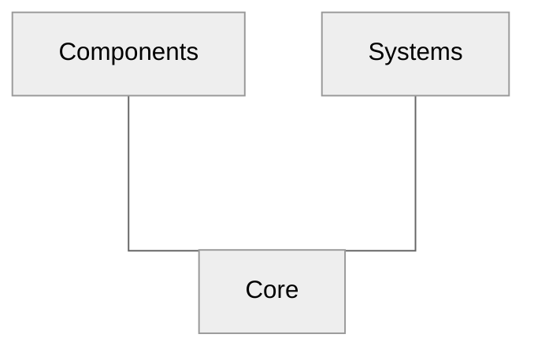

# PBD2D

Unity Position Based Dynamics in two dimensions.

TODO: Add note about packages/and possible upm registry

Position based dynamics is a great method for interactive physics simulation.
For the newcomers the [paper][muller.2007][^1] is highly recommended.

... or [survey][bender.2017][^3]

TODO: Add note about triangulation.

**Package summary:**

- (Extended) position based dynamics, including:
  - Edge length constraint
  - Triangle area constraint
  - Shape matching constraint
- Collision systems:
  - point-line
  - capsule-capsule
  - point-trifield
- Generating simulation bodies using sprites.
- Mouse interaction

## Table od Contents

- [PBD2D](#pbd2d)
  - [Table od Contents](#table-od-contents)
  - [Getting started](#getting-started)
  - [Architecture](#architecture)
  - [Roadmap](#roadmap)
  - [Dependencies](#dependencies)
  - [Bibliography](#bibliography)

## Getting started

Install **WRITE ME**

## Architecture

The project architecture is based on the custom [ECS](https://en.wikipedia.org/wiki/Entity_component_system) pattern and it uses [andywiecko.ECS](https://github.com/andywiecko/ECS) as implementation of the core engine.

The package consist of three main assemblies:

- [`andywiecko.PBD2D.Core`][Core] contains all contracts, common structs, and all required abstractions.
- [`andywiecko.PBD2D.Components`][Components] which consists of components implementations.
- [`andywiecko.PBD2D.Systems`][Systems] contains all available systems for components, i.e. all logic can be found here.

Below one can find a dependency graph for the main project assemblies.

## Roadmap

**v0.1.0**

- [ ] Add friction for trifield-trifield collisions
- [ ] Test for most of the systems.
- [ ] Sample scenes + build online.
  - [ ] Washing machine scene (collisions)
  - [ ] Constraint scene
  - [ ] Friction scene
  - [ ] Shape matching scene
- [ ] Docs.
- [ ] CI/CD, git dependencies for unity-test-runner?
- [ ] Add preview gifs for fluids and rods.
- [ ] Refactor shape matching constraint

**v1.0.0**

- [ ] Add cheap collisions edge-edge
- [ ] TriMesh self collisions (external points/bvt/collisions).
- [ ] Reimport and refactor rod structure.
- [ ] Reimport and refactor position based fluid.
- [ ] Fluid "fancy" shader.
- [ ] Use **dynamic** bounding volume tree for scheduling the collision pairs. 
- [ ] Destructible bodies.
- [ ] Connectors and lockers.
- [ ] Shape matching clusters.
- [ ] Investigate performance with combined dependencies.

**v2.0.0**

- [ ] Position based rigid bodies
- [ ] Continous collisions.
- [ ] GPU fluids.
- [ ] Sign distance field collisions.
- [ ] Position based "smoke".

## Dependencies

- [`Unity.Burst`](https://docs.unity3d.com/Packages/com.unity.burst@1.6/manual/index.html)
- [`Unity.Mathematics`](https://docs.unity3d.com/Packages/com.unity.mathematics@1.2/manual/index.html)
- [`Unity.Collections`](https://docs.unity3d.com/Packages/com.unity.collections@1.0/manual/index.html)
- [`Unity.Jobs`](https://docs.unity3d.com/Manual/JobSystem.html)
- [`andywiecko.ECS`](https://github.com/andywiecko/ECS)
- [`andywiecko.BurstTriangulator`](https://github.com/andywiecko/BurstTriangulator)
- [`andywiecko.BurstCollections`](https://github.com/andywiecko/BurstCollections)
- [`andywiecko.BurstMathUtils`](https://github.com/andywiecko/BurstMathUtils)

## Bibliography

[muller.2007]:https://doi.org/10.1016/j.jvcir.2007.01.005
[^1]:M.Müller, B.Heidelberger, M.Hennix, and J.Ratcliff, "Position based dynamics," [J. Vis. Commun. Image Represent., **18**, 2 (2007)][muller.2007].

[muller.2005]:https://doi.org/10.1145/1073204.1073216
[^2]:M.Müller, B.Heidelberger, M.Teschner, and M.Gros, "Meshless deformations based on shape matching," [ACM Trans. Graph. **24**, 3 (2005)][muller.2005].

[bender.2017]:https://doi.org/10.2312/egt.20171034
[^3]:J.Bender, M.Müller, and M.Macklin, "A Survey on Position Based Dynamics," [EG '17: Proceedings of the European Association for Computer Graphics: Tutorials (2017)][bender.2017].

[Core]:https://github.com/andywiecko/PBD2D/tree/main/Runtime/Core
[Components]:https://github.com/andywiecko/PBD2D/tree/main/Runtime/Components
[Systems]:https://github.com/andywiecko/PBD2D/tree/main/Runtime/Systems
