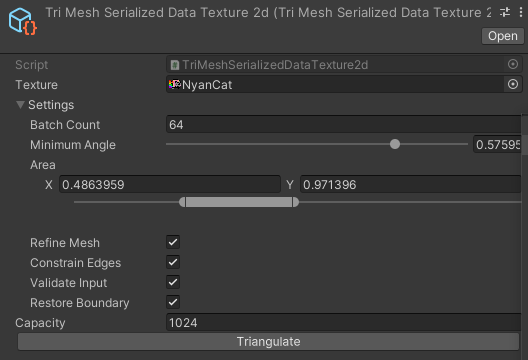

# PBD2D.Components

- [PBD2D.Components](#pbd2dcomponents)
  - [Entities](#entities)
    - [TriMesh](#trimesh)
    - [Ground](#ground)
  - [Tuples](#tuples)

## Entities

### TriMesh

A two-dimensional structure made of triangles.
This is the basic entity used in the PBD2D simulation engine.

One can convert sprites into simulated objects using built-in triangulator and scriptable objects (in project right click and then select `Create/PBD2D/TriMesh/Serialized Data (Texture2d)`) or use predifined shapes.
Below one can find editor preview of the given scriptable object

> **Note**
>
> Derive from `TriMeshSerializedData` to implement custom data.

**Supported features:**

- position based dynamics
- edge length constraint,
- triangle area constraint,
- shape matching constraint.
- collisions
  - capsule-capsule (with TriMesh)
  - point-line (with Ground)
  - point-trifield (with TriMesh)
- mouse interaction

### Ground

The `Ground` corresponds to an infinite line.
Line provides position and normal vectors and is used for collisions with points.
Translation of the component is included into friction calculations, however transform for calculating the translation can be overriden.

**Supported features:**
- collisions
  - point-line (with TriMesh)

## Tuples

Except entities, `PBD2D.Components` contains implementation of tuples which are required for interaction between entities, e.g. collisions.
