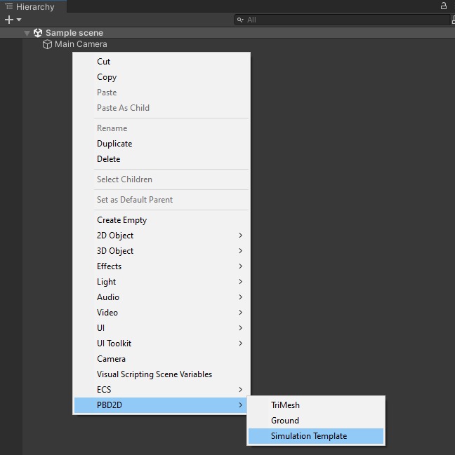
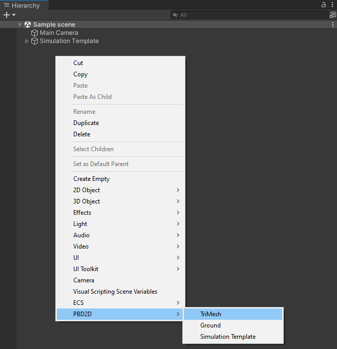
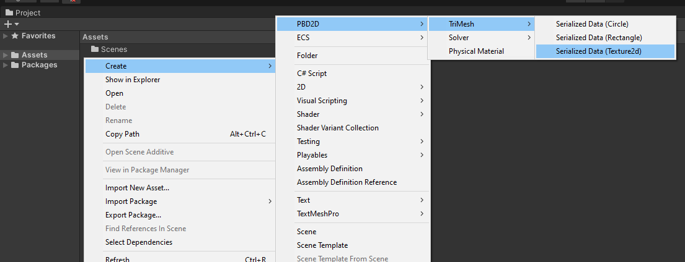
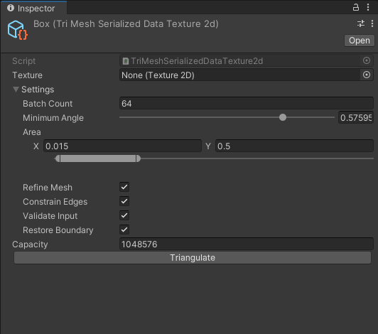
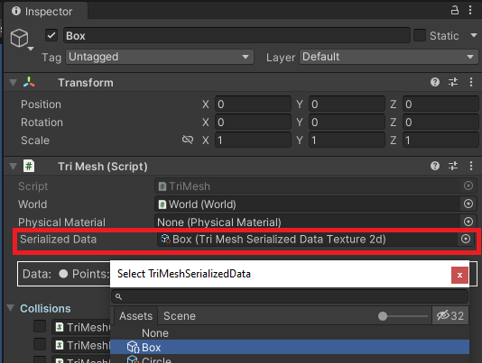
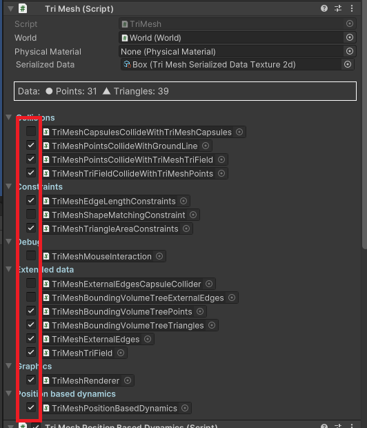
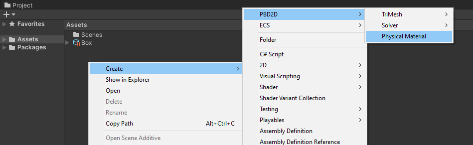

# PBD2D Tutorial

1. Add `Simulation Template` in project hierarchy (right click then `PBD2D/Simulation Template`).

2. Add entity `TriMesh` in project hierarchy (right click then `PBD2D/TriMesh`).

3. Connect entity with the `World` from `Simulation Template`.

4. Create serialized data in project assets.

5. Configure serialized data: select texture for triangulation, and hit "Triangulate" button. 

6. Select created serialized data in created entity. Note: turn on the gizmos to see the `TriMesh` preview. One can return to point 5. and play with the triangulation settings to produce different meshes.

7. Attach components required for your setup. Minimal setup for simulated softbody, collidable with ground and other `TriMesh` can be found below.

8. To control the behavior of the body, i.e. friction or collisions, create `Physical Material` in project assets and attach it the selected entity. 

